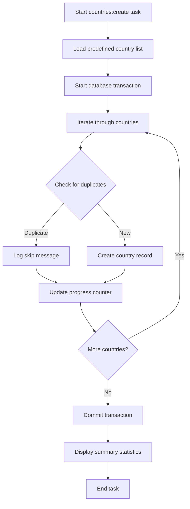

## 1. Product Overview
This upgrade enhances the Addresses Ruby gem to be fully compatible with Rails 8 while maintaining backward compatibility with supported Rails versions. The upgrade includes updating dependencies, implementing Rails 8-specific features, and creating a new Rake task system for automatic country record creation.

The upgrade addresses the need for modern Rails compatibility while adding automation capabilities for country data management, helping developers quickly populate their applications with standardized country information.

## 2. Core Features

### 2.1 User Roles
| Role | Registration Method | Core Permissions |
|------|---------------------|------------------|
| Gem Developer | Gem installation | Can run rake tasks, configure country data |
| Rails Developer | Gem integration | Can use country models, extend attributes |
| System Administrator | Server deployment | Can execute bulk operations, monitor progress |

### 2.2 Feature Module
The Rails 8 compatibility upgrade consists of the following main components:
1. **Dependency Management**: Updated gem dependencies to support Rails 8 requirements
2. **Task Runner System**: New `countries:create` rake task for automated country creation
3. **Error Handling**: Comprehensive error handling for duplicate entries and validation failures
4. **Progress Feedback**: Real-time progress indicators during bulk operations
5. **Transaction Management**: Proper database transaction handling for data integrity

### 2.3 Page Details
| Component | Module Name | Feature description |
|-----------|-------------|---------------------|
| Dependency Management | Gem Specification | Update Rails dependency to ~> 8.0 while maintaining backward compatibility with Rails 6.1+ |
| Task Runner | Rake Task | Create `countries:create` task that reads from predefined country list and generates ActiveRecord models |
| Error Handling | Validation System | Handle duplicate entries gracefully with informative error messages and continue processing |
| Progress Feedback | Console Output | Display real-time progress indicators showing current record and total count during execution |
| Transaction Management | Database Operations | Wrap bulk operations in transactions to ensure data integrity and rollback on failures |

## 3. Core Process
The upgrade process follows these main flows:

**Developer Flow:**
1. Update gem dependencies in Gemfile
2. Run bundle install to get Rails 8 compatible versions
3. Execute `rails addresses:countries:create` to populate country data
4. Verify successful creation through console output and database records

**Task Execution Flow:**

## 4. User Interface Design

### 4.1 Design Style
- **Primary Colors**: Console green (#00FF00) for success, yellow (#FFFF00) for warnings, red (#FF0000) for errors
- **Output Style**: Clean, formatted console output with consistent indentation and spacing
- **Font**: Monospace font for terminal compatibility
- **Layout**: Structured output with clear sections for progress, errors, and summary
- **Progress Indicators**: Visual progress bars and counters showing current/total records

### 4.2 Console Output Design
| Component | Module Name | UI Elements |
|-----------|-------------|-------------|
| Task Start | Initialization | Display task name, version info, and initialization message |
| Progress | Real-time Updates | Show current record number, total count, and percentage complete |
| Error Handling | Validation Messages | Display skipped records with reason codes and continue processing |
| Summary | Completion Report | Show total created, skipped, and failed records with timing information |

### 4.3 Responsiveness
The console output adapts to different terminal widths and supports both interactive and non-interactive modes for CI/CD environments.

## 5. Technical Requirements

### 5.1 Rails 8 Compatibility
- Update ActiveRecord associations to use new Rails 8 syntax
- Implement Rails 8 specific features like composite primary keys support
- Ensure all migrations work with Rails 8 schema format
- Update test suite to work with Rails 8 testing framework

### 5.2 Backward Compatibility
- Maintain support for Rails 6.1 and Rails 7.x versions
- Provide compatibility shims for deprecated features
- Ensure existing API remains unchanged
- Test against multiple Rails versions in CI pipeline

### 5.3 Performance Requirements
- Bulk insert operations should handle 1000+ countries efficiently
- Memory usage should remain under 100MB for large datasets
- Transaction rollback should complete within 5 seconds
- Progress updates should not significantly impact performance

## 6. Data Requirements

### 6.1 Country Data Schema
The predefined country list should include:
- ISO 3166-1 alpha-2 codes (2 characters)
- ISO 3166-1 alpha-3 codes (3 characters)
- Country names in multiple languages
- Optional attributes: capital, currency, phone code, timezone

### 6.2 Validation Rules
- Country code must be unique and match ISO format
- Name must be present and between 2-100 characters
- Duplicate detection based on ISO codes
- Support for soft deletion with timestamps

## 7. Testing Requirements

### 7.1 Test Coverage Areas
- Rails 8 compatibility across all models and controllers
- Task execution with various data scenarios
- Error handling for edge cases
- Transaction rollback scenarios
- Performance benchmarks for large datasets

### 7.2 Test Scenarios
- Happy path: Successful creation of all countries
- Duplicate handling: Skip existing records gracefully
- Error recovery: Handle malformed data and continue
- Transaction safety: Ensure data integrity on failure
- Performance: Validate bulk operations efficiency

## 8. Documentation Requirements

### 8.1 README Updates
- Installation instructions for Rails 8
- Usage examples for the new countries:create task
- Configuration options for custom country attributes
- Migration guide from previous versions

### 8.2 API Documentation
- Document all new public methods and classes
- Provide examples for extending country attributes
- Include error code reference
- Add troubleshooting section for common issues

## 9. Deployment Considerations

### 9.1 Migration Strategy
- Provide upgrade path from existing installations
- Include data migration scripts if needed
- Support for zero-downtime deployments
- Rollback procedures for failed upgrades

### 9.2 Environment Support
- Development environment with detailed logging
- Production environment with performance optimizations
- CI/CD environment with headless operation
- Docker container compatibility for cloud deployments