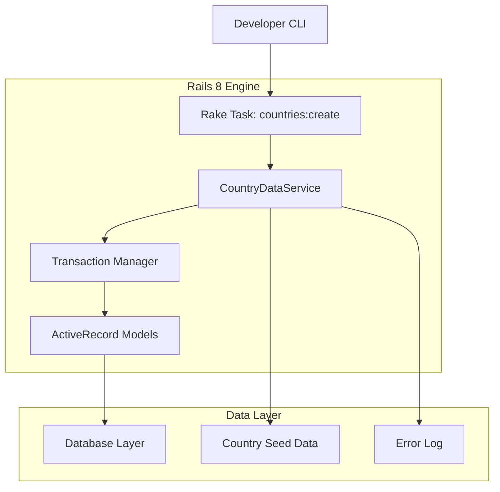
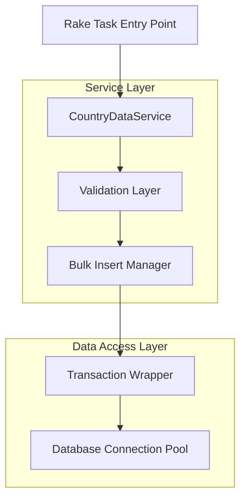
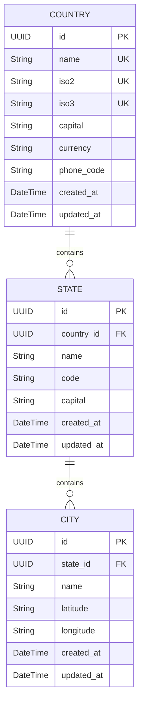

## 1. Architecture Design



## 2. Technology Description

- **Framework**: Rails 8.1.1 with Ruby 3.0+ support
- **Database**: PostgreSQL with Rails 8 schema format support
- **Testing**: RSpec 5.1 with Rails 8 compatibility
- **Task Runner**: Rake with custom task definitions
- **Data Processing**: Bulk insert with transaction management
- **Error Handling**: Structured logging with progress feedback

### Dependency Management
- Rails: ~> 8.0 (supports 6.1+ for backward compatibility)
- ActiveRecord: Enhanced with Rails 8 composite primary keys
- FactoryBot: For test data generation
- SimpleCov: For test coverage reporting

## 3. Route Definitions

| Route | Purpose |
|-------|---------|
| `/addresses/countries` | List all countries with pagination |
| `/addresses/countries/:id` | Show specific country details |
| `/addresses/countries/search` | Search countries by name or code |

## 4. API Definitions

### 4.1 Country Model API

**Country Attributes:**
```ruby
{
  id: UUID,
  name: String,
  iso2: String (2 chars),
  iso3: String (3 chars),
  capital: String (optional),
  currency: String (optional),
  phone_code: String (optional),
  created_at: DateTime,
  updated_at: DateTime
}
```

### 4.2 Rake Task API

**Task Execution:**
```bash
bundle exec rails addresses:countries:create
```

**Options:**
- `--verbose`: Enable detailed progress output
- `--dry-run`: Preview without database changes
- `--limit=N`: Process only first N countries

## 5. Server Architecture Diagram



## 6. Data Model

### 6.1 Country Entity Definition



### 6.2 Database Schema Updates

**Country Table Enhancement:**
```ruby
# Migration for Rails 8 compatibility
class EnhanceCountriesForRails8 < ActiveRecord::Migration[8.0]
  def change
    # Add composite unique index for ISO codes
    add_index :addresses_countries, [:iso2, :iso3], unique: true, name: 'index_countries_on_iso_codes'
    
    # Add full-text search index
    add_index :addresses_countries, :name, using: :gin, opclass: :gin_trgm_ops
    
    # Add generated column for case-insensitive search
    add_column :addresses_countries, :name_lower, :string, generated: true, 
               as: "LOWER(name)", stored: true
    add_index :addresses_countries, :name_lower
  end
end
```

## 7. Task Implementation Details

### 7.1 CountryDataService

```ruby
module Addresses
  class CountryDataService
    include ActiveModel::Model
    
    attr_accessor :verbose, :dry_run, :limit
    
    def initialize(options = {})
      @verbose = options[:verbose] || false
      @dry_run = options[:dry_run] || false
      @limit = options[:limit]
      @created_count = 0
      @skipped_count = 0
      @errors = []
    end
    
    def execute
      log_start
      
      ActiveRecord::Base.transaction do
        process_countries
        raise ActiveRecord::Rollback if @dry_run
      end
      
      log_summary
      { created: @created_count, skipped: @skipped_count, errors: @errors }
    end
    
    private
    
    def process_countries
      countries_data.each_with_index do |country_data, index|
        break if @limit && index >= @limit
        
        process_single_country(country_data)
        update_progress(index + 1, countries_data.size)
      end
    end
    
    def process_single_country(data)
      existing = Country.find_by(iso2: data[:iso2])
      
      if existing
        @skipped_count += 1
        log_skip(data[:name], "Country with ISO2 #{data[:iso2]} already exists")
        return
      end
      
      country = Country.new(data)
      
      if country.save
        @created_count += 1
        log_create(data[:name])
      else
        @errors << { country: data[:name], errors: country.errors.full_messages }
        log_error(data[:name], country.errors.full_messages)
      end
    end
  end
end
```

### 7.2 Country Seed Data

```ruby
module Addresses
  module CountrySeedData
    COUNTRIES = [
      { name: "United States", iso2: "US", iso3: "USA", capital: "Washington D.C.", currency: "USD", phone_code: "+1" },
      { name: "Canada", iso2: "CA", iso3: "CAN", capital: "Ottawa", currency: "CAD", phone_code: "+1" },
      { name: "United Kingdom", iso2: "GB", iso3: "GBR", capital: "London", currency: "GBP", phone_code: "+44" },
      { name: "Germany", iso2: "DE", iso3: "DEU", capital: "Berlin", currency: "EUR", phone_code: "+49" },
      { name: "France", iso2: "FR", iso3: "FRA", capital: "Paris", currency: "EUR", phone_code: "+33" },
      { name: "Japan", iso2: "JP", iso3: "JPN", capital: "Tokyo", currency: "JPY", phone_code: "+81" },
      { name: "Australia", iso2: "AU", iso3: "AUS", capital: "Canberra", currency: "AUD", phone_code: "+61" },
      { name: "Brazil", iso2: "BR", iso3: "BRA", capital: "Brasília", currency: "BRL", phone_code: "+55" },
      { name: "India", iso2: "IN", iso3: "IND", capital: "New Delhi", currency: "INR", phone_code: "+91" },
      { name: "China", iso2: "CN", iso3: "CHN", capital: "Beijing", currency: "CNY", phone_code: "+86" }
    ].freeze
    
    def self.countries_data
      COUNTRIES
    end
    
    def self.sample_countries(n = 5)
      COUNTRIES.sample(n)
    end
  end
end
```

## 8. Rake Task Definition

```ruby
# lib/tasks/countries.rake
namespace :addresses do
  namespace :countries do
    desc "Create country records from predefined seed data"
    task create: :environment do
      options = {}
      
      # Parse command line options
      OptionParser.new do |opts|
        opts.banner = "Usage: rails addresses:countries:create [options]"
        
        opts.on("-v", "--verbose", "Run verbosely") do |v|
          options[:verbose] = v
        end
        
        opts.on("-d", "--dry-run", "Preview without making changes") do |d|
          options[:dry_run] = d
        end
        
        opts.on("-l", "--limit N", Integer, "Limit number of countries to process") do |l|
          options[:limit] = l
        end
        
        opts.on("-h", "--help", "Show this help message") do
          puts opts
          exit
        end
      end.parse!
      
      puts "Starting countries creation task..."
      puts "Options: #{options.inspect}" if options[:verbose]
      
      service = Addresses::CountryDataService.new(options)
      result = service.execute
      
      puts "\nTask completed successfully!"
      puts "Created: #{result[:created]} countries"
      puts "Skipped: #{result[:skipped]} countries"
      
      if result[:errors].any?
        puts "Errors encountered:"
        result[:errors].each do |error|
          puts "  - #{error[:country]}: #{error[:errors].join(', ')}"
        end
      end
    end
  end
end
```

## 9. Testing Architecture

### 9.1 Test Structure

```
spec/
├── services/
│   └── addresses/
│       └── country_data_service_spec.rb
├── tasks/
│   └── countries.rake_spec.rb
├── models/
│   └── addresses/
│       └── country_spec.rb
└── integration/
    └── rails_8_compatibility_spec.rb
```

### 9.2 Key Test Scenarios

**Rails 8 Compatibility Tests:**
- Migration compatibility with Rails 8 schema format
- ActiveRecord associations with new Rails 8 syntax
- Composite primary key support
- Transaction handling with Rails 8

**Task Execution Tests:**
- Successful creation of countries from seed data
- Duplicate detection and graceful handling
- Dry-run mode functionality
- Progress feedback and error reporting
- Transaction rollback on failure

**Performance Tests:**
- Bulk insert efficiency with 1000+ records
- Memory usage under load
- Transaction performance with large datasets
- Error recovery speed

## 10. Deployment Considerations

### 10.1 Migration Strategy

1. **Dependency Update**: Update gemspec to support Rails 8
2. **Database Migration**: Run Rails 8 compatible migrations
3. **Task Deployment**: Deploy new rake task to production
4. **Data Population**: Execute countries:create task in production
5. **Verification**: Validate data integrity and application functionality

### 10.2 Rollback Procedures

- Maintain backward compatibility with Rails 6.1+
- Provide migration rollback scripts
- Keep previous version tags for emergency rollback
- Document rollback procedures in deployment guide

### 10.3 Performance Optimization

- Use bulk insert operations for large datasets
- Implement connection pooling for database operations
- Add database indexes for improved query performance
- Monitor memory usage during bulk operations
- Implement progress checkpoints for long-running tasks